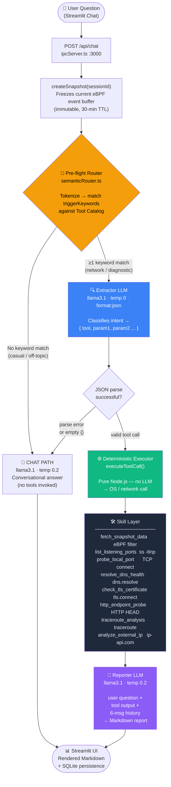
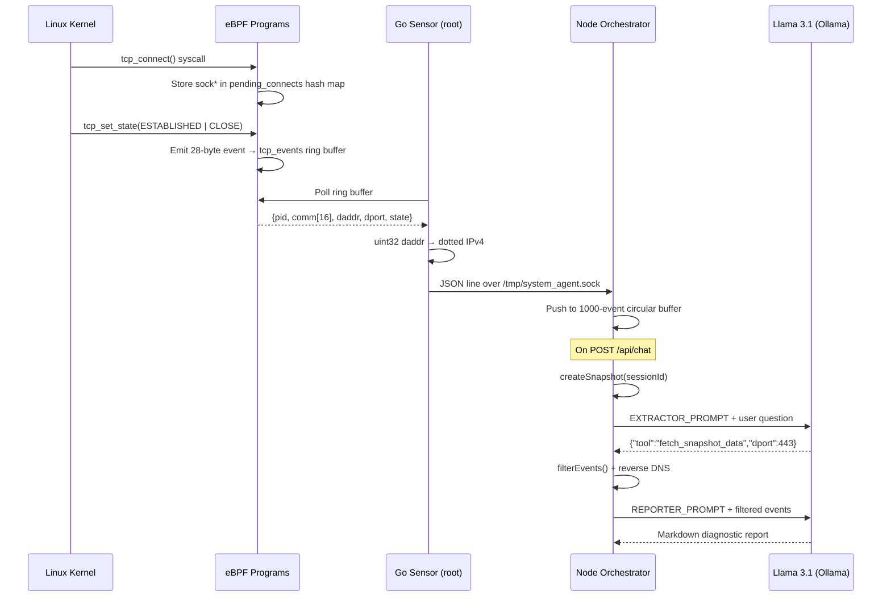

<div align="center">

# 🔬 NetSkill Agent

### *Autonomous Network Diagnostics, Powered by eBPF and Local AI*

> **Local-first · Privacy-preserving · AI-driven network observability**
> 
> NetSkill Agent fuses kernel-level eBPF telemetry with on-device large language models to deliver autonomous, hallucination-resistant network diagnostics — no cloud, no data leakage, no guesswork.

---


</div>

---

## Overview

Most network observability stacks require shipping your telemetry to a vendor, trusting a cloud LLM with potentially sensitive connection data, or stitching together a dozen CLI tools by hand.

**NetSkill Agent eliminates all three trade-offs.**

At the kernel level, a Go-based eBPF sensor attaches `kprobe`s to `tcp_connect` and `tcp_set_state` to capture every outbound TCP connection — process name, destination IP, port, and state transition — with nanosecond precision and zero packet capture overhead. That stream flows over a Unix Domain Socket into a Node.js/TypeScript orchestrator, which runs a four-stage autonomous pipeline: **Pre-flight Router → Extractor → Executor → Reporter**. A Streamlit dashboard exposes both a Wireshark-style live traffic monitor and a conversational AI copilot, all talking exclusively to `localhost`.

Every LLM inference happens inside [Ollama](https://ollama.com) on your machine. Your traffic data never leaves the host.

---

## Key Features

- 🧠 **Autonomous Four-Stage Pipeline** — A keyword-aware Pre-flight Router decides at zero cost whether a question needs tools at all. If it does, an Extractor LLM classifies intent into a structured JSON tool call; a deterministic Executor runs the actual command or API; a Reporter LLM synthesizes a Markdown answer — all without human intervention.

- 🔒 **Hallucination-Resistant by Design** — The LLM never executes tools and never fabricates network data. Only the deterministic Node.js Executor layer touches the OS (`ss`, `traceroute`, `dns.resolve`, `tls.connect`). The LLM sees only what the OS returned, so it cannot invent IPs, ports, or latency values.

- 🐝 **Kernel-Native eBPF Telemetry** — Two kprobes on `tcp_connect` and `tcp_set_state` stream enriched TCP events through a 16 MB ring buffer to userspace. No `tcpdump`, no `libpcap`, no dropped packets under load.

- 🌐 **Eight Specialized Diagnostic Skills** — Port inventory (`ss -tlnp`), active TCP probing, DNS health checks (A + AAAA), TLS certificate introspection, HTTP endpoint probing, IP geolocation, traceroute path analysis, and live eBPF snapshot filtering — each wired as an independently testable TypeScript module.

- 💬 **Bilingual Routing (Turkish & English)** — The keyword router and all LLM prompts are engineered for both Turkish and English; the Reporter is instructed to always respond in the user's own language, making the agent equally fluent for `"YouTube'a giremiyorum"` and `"connection refused on port 443"`.

- 📊 **Live Traffic Monitor Dashboard** — The Streamlit UI polls the orchestrator every 2 seconds and renders a Wireshark-style table of eBPF events with process names, destination IPs, ports, and TCP states — updated in real time.

- 🗄️ **Persistent Conversation Memory** — Chat history is stored in a local SQLite database. Sessions survive page reloads; the Reporter receives the last six turns as context for coherent multi-turn diagnostics.

- 🏠 **Fully Local-First** — Ollama runs `llama3.1` on-device. The eBPF sensor, orchestrator, and UI are all `localhost`. Zero telemetry is sent to any external service except the optional `ip-api.com` geolocation call for the `analyze_external_ip` tool.

---

## Architecture

### High-Level Component Map

```
┌─────────────────────────────────────────────────────────────────────┐
│                          HOST MACHINE                               │
│                                                                     │
│  ┌──────────────┐    UDS JSON     ┌─────────────────────────────┐  │
│  │  Go eBPF     │ ──────────────▶ │   Node.js Orchestrator      │  │
│  │  Sensor      │  /tmp/system_   │   (ipcServer.ts)            │  │
│  │  (root)      │   agent.sock    │   HTTP :3000                │  │
│  └──────────────┘                 └──────────────┬──────────────┘  │
│   kprobe:tcp_connect                             │                  │
│   kprobe:tcp_set_state                    GET /memory              │
│   16 MB ring buffer                       POST /api/chat            │
│                                                  │                  │
│                                    ┌─────────────▼──────────────┐  │
│                                    │   Streamlit UI             │  │
│                                    │   (Python :8501)           │  │
│                                    │   Dashboard · Monitor      │  │
│                                    │   Copilot Chat             │  │
│                                    └────────────────────────────┘  │
│                                                                     │
│  ┌────────────────────────────────────────────────────────────┐    │
│  │  Ollama  (localhost:11434)  ·  llama3.1                    │    │
│  └────────────────────────────────────────────────────────────┘    │
└─────────────────────────────────────────────────────────────────────┘
```

### The Four-Stage Autonomous Pipeline



### eBPF Event Flow



---

## Tech Stack

| Layer | Technology | Role |
|-------|-----------|------|
| **Frontend** | Python 3.11 · Streamlit 1.x | Dashboard, live traffic monitor, copilot chat UI |
| **Frontend** | SQLite (via `sqlite3`) | Persistent conversation history |
| **Orchestrator** | Node.js 20 · TypeScript 5 · `ts-node` | HTTP API server, pipeline orchestration, tool execution |
| **Orchestrator** | Unix Domain Socket (`net` module) | High-throughput eBPF event ingestion from Go sensor |
| **AI / LLM** | [Ollama](https://ollama.com) | Local LLM inference server (default `localhost:11434`) |
| **AI / LLM** | Meta Llama 3.1 (`llama3.1`) | Extractor (JSON mode, temp 0) + Reporter (temp 0.2) |
| **AI / LLM** | LangChain (`@langchain/ollama`, `@langchain/core`) | LLM client, message assembly, tool schema definitions |
| **AI / LLM** | Zod | Runtime validation of tool wrapper schemas |
| **System** | Go 1.24 | eBPF sensor userspace runtime |
| **System** | [cilium/ebpf](https://github.com/cilium/ebpf) v0.21 | BPF object loading, ring buffer consumer, bpf2go codegen |
| **System** | eBPF C (`sensor.c`) | `kprobe/tcp_connect`, `kprobe/tcp_set_state`, ring buffer |
| **System** | `ss` / `netstat` | Listening port enumeration |
| **System** | `traceroute` / `tracepath` | Network path analysis |
| **System** | `ip-api.com` | IP geolocation (single external dependency) |

---

## Getting Started

### Prerequisites

| Dependency | Version | Notes |
|-----------|---------|-------|
| Linux kernel | ≥ 5.8 | Ring buffer support (`BPF_MAP_TYPE_RINGBUF`) |
| Go | ≥ 1.24 | Required to build the eBPF sensor |
| Node.js | ≥ 20 LTS | Orchestrator runtime |
| Python | ≥ 3.11 | Streamlit UI |
| Ollama | latest | Local LLM inference |
| `clang` + `llvm` | ≥ 14 | Compile eBPF C source |
| `linux-headers` | matching kernel | Required for `vmlinux.h` / BTF |

> **Privilege note:** The eBPF sensor must run as `root` or with `CAP_BPF + CAP_NET_ADMIN`. The orchestrator and UI run as a regular user.

---

### 1 — Install Ollama and pull the model

```bash
# Install Ollama
curl -fsSL https://ollama.com/install.sh | sh

# Pull Llama 3.1 (≈ 4.7 GB)
ollama pull llama3.1

# Verify it's running
ollama list
```

---

### 2 — Build and run the eBPF sensor

```bash
cd network_sensor

# Generate vmlinux.h from the running kernel (requires bpftool)
bpftool btf dump file /sys/kernel/btf/vmlinux format c > ebpf/vmlinux.h

# Build the Go binary (bpf2go auto-compiles sensor.c via clang)
go build -o build/sensor .

# Run with elevated privileges
sudo ./build/sensor
```

The sensor will begin streaming JSON events to `/tmp/system_agent.sock`. Keep this terminal open.

---

### 3 — Start the Node.js orchestrator

```bash
cd orchestrator

# Install dependencies
npm install

# Start the server (HTTP :3000 + UDS listener)
npx ts-node src/ipcServer.ts
```

You should see:

```
[IPC] UDS server listening on /tmp/system_agent.sock
[HTTP] Orchestrator API listening on http://localhost:3000
```

---

### 4 — Launch the Streamlit UI

```bash
cd ui_listener

# Create and activate a virtual environment
python -m venv venv
source venv/bin/activate

# Install Python dependencies
pip install -r requirements.txt

# Start the dashboard
streamlit run app.py
```

Open **http://localhost:8501** in your browser.

---

### System Startup Order

```
1. ollama serve          (background, port 11434)
2. sudo ./sensor         (root, streams to /tmp/system_agent.sock)
3. npx ts-node ipcServer (port 3000, consumes UDS socket)
4. streamlit run app.py  (port 8501, calls :3000)
```

---

## Use Cases

### Scenario 1 — "I can't access YouTube"

**User types:** `"I can't reach YouTube, what's going on?"`

**What happens:**

1. **Pre-flight Router** tokenizes the input. The token `reach` matches `fetch_snapshot_data`'s trigger keyword list.
2. **Extractor LLM** receives the question and the tool catalog. Returns:
   ```json
   { "tool": "fetch_snapshot_data", "dport": 443, "limit": 15 }
   ```
3. **Executor** calls `filterEvents(sessionId, { dport: 443, limit: 15 })`. It filters the eBPF snapshot and runs a reverse DNS lookup on each destination IP.
4. **Reporter LLM** receives the enriched events and synthesizes a Markdown report:

   > **Network Analysis Report**
   >
   > The last 15 TCP connection events have been examined. Multiple connection attempts to `youtube.com` (142.250.x.x) on port 443 are present in the snapshot; however, every attempt terminated in the `TCP_CLOSE` state — no `TCP_ESTABLISHED` event was recorded.
   >
   > **Likely Causes:** Port 443 blocked by your ISP, DNS resolution failure, or a local firewall rule dropping outbound HTTPS.
   >
   > **Recommended Next Step:** Use the `dns` or `tls` skills to probe the YouTube domain directly and isolate whether the issue is at the DNS, TCP, or TLS layer.

---

### Scenario 2 — "Port 8080 is already in use"

**User types:** `"Port 8080 already in use, what's listening there?"`

**What happens:**

1. **Pre-flight Router** matches `port` and `listening` → routes to network pipeline.
2. **Extractor LLM** returns:
   ```json
   { "tool": "list_listening_ports" }
   ```
3. **Executor** runs `ss -tlnp` (falling back to `netstat -tlnp` if unavailable) and parses the output into a structured list.
4. **Reporter LLM** produces:

   > **Port Inventory Report**
   > 
   > The following processes are currently bound to TCP ports on this host:
   > 
   > | Port | State  | Process |
   > |------|--------|---------|
   > | 8080 | LISTEN | `node` (PID 14823) |
   > | 3000 | LISTEN | `ts-node` (PID 11240) |
   > | 11434| LISTEN | `ollama` (PID 9571) |
   > 
   > **Port 8080** is held by `node` (PID 14823). To free it, run `kill 14823` or change your application's bind port.

---

### Scenario 3 — "Is the TLS certificate for api.example.com still valid?"

**User types:** `"Is the TLS certificate for api.example.com still valid?"`

1. **Router** matches `tls` and `certificate` → pipeline.
2. **Extractor** → `{ "tool": "check_tls_certificate", "hostname": "api.example.com" }`
3. **Executor** opens a `tls.connect` socket (5 s timeout), reads the peer certificate, extracts `subject`, `issuer`, `valid_from`, `valid_to`, and `days_remaining`.
4. **Reporter** produces a structured Markdown summary:

   > **TLS Certificate Report — api.example.com**
   >
   > | Field | Value |
   > |-------|-------|
   > | Subject | `CN=api.example.com` |
   > | Issuer | `Let's Encrypt Authority X3` |
   > | Valid From | `2026-01-15` |
   > | Valid To | `2026-04-15` |
   > | Days Remaining | **9** ⚠️ |
   >
   > **Warning:** The certificate expires in fewer than 30 days. Renew immediately to avoid service disruption. If using Certbot, run `certbot renew --dry-run` to verify auto-renewal is configured correctly.

---

## Project Structure

```
system-agent/
│
├── network_sensor/          # Go + eBPF TCP event sensor (requires root)
│   ├── ebpf/
│   │   └── sensor.c         # kprobe programs + ring buffer map
│   ├── main.go              # BPF object loader, ring buffer consumer
│   └── uds_client.go        # JSON line writer → /tmp/system_agent.sock
│
├── orchestrator/            # Node.js TypeScript API + pipeline
│   └── src/
│       ├── ipcServer.ts     # Entry point: UDS + HTTP :3000
│       ├── core/
│       │   ├── semanticRouter.ts   # Pre-flight keyword router
│       │   ├── supervisor.ts       # Extractor / Executor / Reporter
│       │   └── snapshotStore.ts    # Immutable session snapshot cache
│       └── tools/
│           ├── toolRegistry.ts     # Central tool catalog + keywords
│           └── wrappers/           # LangChain tool() schema wrappers
│
├── skills/                  # Framework-free diagnostic skill modules
│   ├── listListeningPorts.ts
│   ├── probeLocalPort.ts
│   ├── resolveDnsHealth.ts
│   ├── checkTlsCertificate.ts
│   ├── httpEndpointProbe.ts
│   ├── tracerouteAnalysis.ts
│   └── lookupIpInfo.ts
│
└── ui_listener/             # Streamlit Python frontend
    ├── app.py               # System dashboard (home)
    ├── pages/
    │   ├── 01_traffic_monitor.py   # Live eBPF event table
    │   └── 02_copilot_chat.py      # AI copilot chat
    ├── chat_history.py      # SQLite conversation persistence
    └── config.py            # API base URL, refresh intervals
```

---

## Design Principles

**Separation of inference from execution.** The LLM touches exactly two things: intent classification (Extractor) and natural language synthesis (Reporter). All data collection is deterministic Node.js code. This makes the system auditable and prevents the model from fabricating network observations.

**Pre-flight routing as cost control.** Before any LLM call, the keyword router checks whether the question is diagnostic at all. Casual conversation (`"How are you?"`) is answered directly by the Reporter model without invoking the Extractor — saving one full LLM round-trip and eliminating any risk of spurious tool calls.

**Immutable session snapshots.** When a chat request arrives, the current eBPF event buffer is frozen into a UUID-keyed snapshot with a 30-minute TTL. Subsequent tool calls within the same session operate on identical data, making answers reproducible and eliminating race conditions between the sensor and the agent.

**Local-first privacy.** The architecture is explicitly designed so that raw connection telemetry (which processes talk to which IPs on which ports) stays on the host. The only outbound call is the optional geolocation lookup for the `analyze_external_ip` tool, and that can be replaced with a self-hosted solution.

---

## Contributing

Pull requests are welcome. For significant changes, please open an issue first to discuss what you would like to change.

Areas with the most opportunity:

- **Environment variable configuration** — Ollama host, model name, HTTP port, and socket path are currently hardcoded constants.
- **LangGraph ReAct loop** — The tool wrappers in `tools/wrappers/` are already defined; wiring them into a proper ReAct graph would enable multi-hop reasoning.
- **Containerization** — A `docker-compose.yml` that runs the orchestrator and UI (with the sensor on the host via `--privileged`).
- **Test coverage** — The skill modules are pure functions; unit tests with mock data would be straightforward.
- **Additional skills** — `nmap` wrapper, BGP route lookup, interface statistics via `/proc/net/dev`.

---

## License

MIT © NetSkill Agent Contributors

---

<div align="center">

*Built with eBPF, local AI, and a deep respect for your network's privacy.*

</div>
